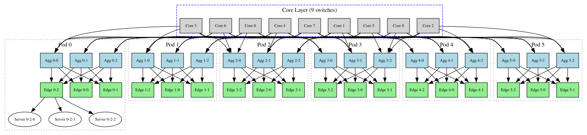

# P4sim Artifact: Simulating Programmable Switches in ns-3

This repository contains the artifact for the paper:

**"P4sim: Simulating programmable switches in ns-3"**
Accepted at the *2025 International Conference on ns-3 (ICNS3)*.



---

## Table of Contents

1. [Overview](#overview)
2. [Repository Structure](#repository-structure)
3. [Requirements and Environment Setup](#requirements-and-environment-setup)
4. [Quick Start — Your First P4sim Simulation](#quick-start--your-first-p4sim-simulation)
5. [Example Tutorials](#example-tutorials)
   - [1. IPv4 Forwarding (V1model)](#1-ipv4-forwarding-v1model)
   - [2. IPv4 Forwarding (PSA)](#2-ipv4-forwarding-psa)
   - [3. Basic Example — Multi-Switch Topology](#3-basic-example--multi-switch-topology)
   - [4. Basic Tunnel — Custom Header Forwarding](#4-basic-tunnel--custom-header-forwarding)
   - [5. Stateful Firewall](#5-stateful-firewall)
   - [6. Spine-Leaf Load Balancing](#6-spine-leaf-load-balancing)
   - [7. Fat-Tree Large-Scale Network](#7-fat-tree-large-scale-network)
6. [Reproducing Paper Results](#reproducing-paper-results)
   - [Section 5.1 — IPv4 Forwarding Throughput](#section-51--ipv4-forwarding-throughput)
   - [Section 5.2 — Load Balancing in Spine-Leaf](#section-52--load-balancing-in-spine-leaf)
   - [Section 5.3 — Custom Header Tunnel](#section-53--custom-header-tunnel)
7. [Priority Queue Test (Figure 6)](#priority-queue-test-figure-6)
8. [Generating Paper Figures](#generating-paper-figures)
9. [References](#references)

---

## Overview

P4sim is a P4-programmable switch simulation module for ns-3. It allows users to:

- Write P4 programs that run inside ns-3 switches using the BMv2 behavioral model
- Simulate programmable network functions (forwarding, tunneling, firewalling, load balancing, QoS) in a controlled environment
- Compare the behavior and performance of P4-programmed switches against standard ns-3 bridge devices and real Mininet/BMv2 deployments

This artifact provides everything needed to reproduce the key results and figures from the paper.

---

## Repository Structure

```
.
├── Readme.md                        ← This file
├── figures/                         ← Final paper figures (PDF)
│   ├── load_balancing.pdf
│   ├── load-balancer.drawio.pdf
│   ├── network_simulation_time.pdf
│   ├── network_simulation_time_comparison.pdf
│   └── network_throughput_comparison.pdf
├── pdf
│   └── p4sim_icns3.pdf              ← Full paper PDF
├── plot/                            ← Python scripts to regenerate figures
│   ├── Readme.md
│   ├── ipv4_forwarding_v1.py        ← Figure 4: throughput comparison
│   ├── ipv4_forwarding_v2.py        ← Figure 4: alternate style (deprecated)
│   ├── ipv4_time_usage.py           ← Figure 4: simulation time (uniform axis)
│   ├── ipv4_time_usage_v1.py        ← Figure 4: simulation time (broken axis, used in paper)
│   ├── read_and_compute_ratio.py    ← Helper: compute path traffic ratio
│   └── throughput_lb.py             ← Figure 7: load balancing throughput
├── raw_result/                      ← Raw throughput data for Figure 4 & 5
│   ├── load_balance/
│   │   └── traffic_data.txt
│   ├── pcap_ipv4_forwarding/
│   └── print_ipv4_forwarding/
│       ├── Readme.md
│       ├── ipv4_forward_throughput_mininet_bmv2
│       ├── ipv4_forward_throughput_mininet_bmv2_summary
│       ├── ipv4_forward_throughput_ns3
│       └── ipv4_forward_throughput_p4sim
└── examples_test_result/            ← Captured outputs and PCAPs per example
    ├── p4-basic-example/
    ├── p4-basic-tunnel/
    ├── p4-fat-tree/
    ├── p4-firewall/
    ├── p4-psa-ipv4-forwarding/
    ├── p4-queue-test/               ← Priority queue experiment
    ├── p4-spine-leaf-topo/
    └── p4-v1model-ipv4-forwarding/
```

All simulation scripts live in the [p4sim repository](https://github.com/HapCommSys/p4sim) under `examples/`. P4 programs live under `examples/p4src/`.

---

## Requirements and Environment Setup

### Option A: Virtual Machine (Recommended for reproducibility)

A pre-configured VM image with all dependencies installed is available. Follow the setup guide at:

[P4Sim: NS-3-Based P4 Simulation Environment](https://github.com/HapCommSys/p4sim/blob/main/doc/vm-env.md)

**Tested configurations:**
- ns-3 3.36 – 3.39 (used in this paper, recommended)
- ns-3 3.x – 3.35 (also tested)

### Option B: Native Ubuntu Deployment

Install the dependencies manually:

```bash
# System packages
sudo apt-get update
sudo apt-get install -y build-essential git cmake python3 python3-pip \
  libboost-all-dev libgmp-dev libpcap-dev pkg-config

# Python plotting dependencies
pip install numpy matplotlib brokenaxes dpkt
```

Then clone and build p4sim as an ns-3 contrib module:

```bash
git clone https://github.com/HapCommSys/p4sim.git contrib/p4sim
./ns3 configure --enable-examples
./ns3 build
```

Refer to the [full setup instructions](https://github.com/HapCommSys/p4sim/blob/main/doc/vm-env.md) for detailed steps including BMv2 and p4c installation.

---

## Quick Start — Your First P4sim Simulation

The simplest way to verify your setup is to run the basic IPv4 forwarding example. It uses a single P4 switch connecting two hosts.

```bash
cd ~/workdir/ns-3-dev-git
./ns3 run p4-v1model-ipv4-forwarding
```

Expected output (abridged):

```
*** Host number: 2, Switch number: 1
Running simulation...
P4 switch 1 thrift port: 9090
Simulate Running time: 1834ms
Total Running time: 1872ms
Run successfully!
======================================
Final Simulation Results:
Total Transmitted Bytes: 1114000 bytes in time 2.97067
Total Received Bytes: 1113000 bytes in time 2.968
Final Transmitted Throughput: 3 Mbps
Final Received Throughput: 3 Mbps
======================================
```

If you see `Run successfully!` and matching TX/RX throughput, your environment is working correctly. See the [full example documentation](examples_test_result/p4-v1model-ipv4-forwarding/Readme.md).

---

## Example Tutorials

The table below lists all available examples. Each has a dedicated subdirectory in `examples_test_result/` with captured console output, PCAP files, and detailed notes.

| Example | Architecture | What it demonstrates | Result dir |
|---------|-------------|---------------------|------------|
| `p4-v1model-ipv4-forwarding` | V1model | Minimal IPv4 forwarding benchmark | [link](examples_test_result/p4-v1model-ipv4-forwarding/) |
| `p4-psa-ipv4-forwarding` | PSA | Same forwarding using PSA architecture | [link](examples_test_result/p4-psa-ipv4-forwarding/) |
| `p4-basic-example` | V1model | IPv4 forwarding + ARP, 4-switch mesh | [link](examples_test_result/p4-basic-example/) |
| `p4-basic-tunnel` | V1model | Custom tunnel header over 3-switch topology | [link](examples_test_result/p4-basic-tunnel/) |
| `p4-firewall` | V1model | Stateful firewall using a Bloom filter | [link](examples_test_result/p4-firewall/) |
| `p4-spine-leaf-topo` | V1model | ECMP load balancing in spine-leaf | [link](examples_test_result/p4-spine-leaf-topo/) |
| `p4-topo-fattree` | V1model | Fat-tree k=6 (45 switches, 54 hosts) | [link](examples_test_result/p4-fat-tree/) |
| `p4-queue-test` | V1model | Priority queue scheduling (Figure 6) | [link](examples_test_result/p4-queue-test/) |
---

### 1. IPv4 Forwarding (V1model)

**What it tests:** End-to-end forwarding of UDP traffic through a single P4 switch using the V1model architecture. This is the baseline for the throughput and timing benchmarks in the paper.

**Topology:**
```
[ Host 0 ] ── [ P4 Switch (V1model) ] ── [ Host 1 ]
```

**Run:**
```bash
./ns3 run p4-v1model-ipv4-forwarding
```

**With options:**
```bash
./ns3 run "p4-v1model-ipv4-forwarding --model=0 --pktSize=1000 --appDataRate=10Mbps --pcap=true"
```

| Parameter | Default | Description |
|-----------|---------|-------------|
| `model` | `0` | `0` = P4 switch, `1` = ns-3 bridge |
| `pktSize` | `1000` | Packet size in bytes |
| `appDataRate` | `1Mbps` | Application sending rate |
| `pcap` | `false` | Enable PCAP capture |
| `runnum` | `1` | Run index (for scripted loops) |

Switch between `--model=0` (P4 switch) and `--model=1` (ns-3 bridge) to reproduce the comparison data for Figures 4 and 5.

See [examples_test_result/p4-v1model-ipv4-forwarding/Readme.md](examples_test_result/p4-v1model-ipv4-forwarding/Readme.md) for full output.

---

### 2. IPv4 Forwarding (PSA)

**What it tests:** The same minimal forwarding scenario, but with the PSA (Portable Switch Architecture) instead of V1model. Validates that p4sim supports multiple P4 architecture targets.

**Topology:** identical to V1model example above.

**Run:**
```bash
./ns3 run p4-psa-ipv4-forwarding
```

Expected throughput: ~3 Mbps TX and RX, confirming the P4 PSA pipeline processes packets correctly.

See [examples_test_result/p4-psa-ipv4-forwarding/Readme.md](examples_test_result/p4-psa-ipv4-forwarding/Readme.md).

---

### 3. Basic Example — Multi-Switch Topology

**What it tests:** IPv4 forwarding with ARP support across a 4-switch mesh connecting 4 hosts. Based on the [p4lang/tutorials basic exercise](https://github.com/p4lang/tutorials/tree/master/exercises/basic).

**Topology:**
```
        ┌──────────┐              ┌──────────┐
        │ Switch 2 \            / │ Switch 3 │
        └─────┬────┘  \      /   └──────┬───┘
              │          \  /           │
        ┌─────┴────┐   /    \    ┌──────┴───┐
        │ Switch 0 /          \  │ Switch 1 │
        └─────┬────┘             └──────┬───┘
              │  \              /       │
         [ h0 ] [ h1 ]       [ h2 ] [ h3 ]

```

**Run:**
```bash
./ns3 run p4-basic-example
```

All 4 hosts can communicate through 4 P4 switches. Final throughput should be ~3 Mbps with minimal packet loss.

See [examples_test_result/p4-basic-example/Readme.md](examples_test_result/p4-basic-example/Readme.md).

---

### 4. Basic Tunnel — Custom Header Forwarding

**What it tests:** Custom tunnel header insertion at the host and P4-based routing using a non-standard field (`dst_id`) instead of the IP destination address. Demonstrates p4sim's ability to simulate novel packet formats. Based on [p4lang/tutorials basic_tunnel](https://github.com/p4lang/tutorials/tree/master/exercises/basic_tunnel).

**Topology:**
```
[ h0 ] ── [ Switch 0 ] ── [ Switch 1 ] ──── [ h1 ]
                    \                  /
                     ── [ Switch 2 ] ──
```

Two flows run concurrently from h0 to h1:
- **Tunnel flow** (custom header, routed via the short path: Switch 0 → Switch 1)
- **Normal UDP flow** (standard IPv4, routed via the long path: Switch 0 → Switch 2 → Switch 1)

**Run:**
```bash
./ns3 run p4-basic-tunnel
# Or with options:
./ns3 run "p4-basic-tunnel --pktSize=1000 --pcap=true"
```

**What to check in the PCAP:** Open `p4-basic-tunnel-1-1.pcap` (Switch 1 egress) in Wireshark. You will see the `CustomHeader` fields (`proto_id`, `dst_id`) prepended before the IPv4 header for tunnel packets.

See [examples_test_result/p4-basic-tunnel/Readme.md](examples_test_result/p4-basic-tunnel/Readme.md).

---

### 5. Stateful Firewall

**What it tests:** A stateful firewall implemented entirely in the P4 data plane using a Bloom filter. Based on [p4lang/tutorials firewall](https://github.com/p4lang/tutorials/tree/master/exercises/firewall).

**Topology:** Same 4-switch pod topology as the basic example. Switch 0 runs the firewall P4 program; the other switches run a basic IPv4 forwarder.

**Firewall policy:**
- h0 and h1 (internal) can freely initiate connections to anyone
- h2 and h3 (external) can only **reply** to existing connections — they cannot initiate new ones

**Three test flows:**
1. TCP: h0 → h3 (port 9093) — should pass (internal initiates)
2. UDP: h3 → h0 (port 9200) — should pass (reply to established connection)
3. UDP: h1 → h0 (port 9003) — should pass (both internal)

**Run:**
```bash
./ns3 run p4-firewall
```

Enable PCAP to inspect which packets are forwarded or dropped at Switch 0.

See [examples_test_result/p4-firewall/Readme.md](examples_test_result/p4-firewall/Readme.md).

---

### 6. Spine-Leaf Load Balancing

**What it tests:** ECMP (Equal-Cost Multi-Path) load balancing across two spine switches in a spine-leaf topology. Measures per-path throughput to verify that the P4 program distributes traffic approximately 50/50.

**[Topo.pdf](figures/load-balancer.drawio.pdf)**

**Run:**
```bash
./ns3 run p4-spine-leaf-topo
```

Per-second throughput at each switch is printed during the simulation. After the run, use the plotting script to see path-level distribution:

```bash
cd raw_result/load_balance
python3 ../../plot/read_and_compute_ratio.py   # prints path A/B ratio
python3 ../../plot/throughput_lb.py            # generates load_balancing.pdf
```

Expected: Path A ≈ Path B ≈ 50% of total input traffic.

See [examples_test_result/p4-spine-leaf-topo/Readme.md](examples_test_result/p4-spine-leaf-topo/Readme.md).

---

### 7. Fat-Tree Large-Scale Network

**What it tests:** P4sim's ability to simulate a large-scale fat-tree data center topology with k=6 (45 P4 switches, 54 hosts). Validates scalability and correctness of automated flow-table generation.

**Network structure:**

| Tier | Count | Switch IDs |
|------|-------|-----------|
| Core | 9 | 0–8 |
| Aggregation | 18 | 9–26 |
| Edge | 18 | 27–44 |

**Run:**
```bash
./ns3 run "p4-topo-fattree -- --podnum=6 --pcap=true"
```

The script automatically:
1. Generates the fat-tree topology for the given `podnum`
2. Creates all P4 switch flow table entries
3. Runs random host-to-host traffic flows
4. Reports total simulation time

Expected runtime: ~55 seconds for k=6.


See [examples_test_result/p4-fat-tree/Readme.md](examples_test_result/p4-fat-tree/Readme.md).

---

## Reproducing Paper Results

The paper has three evaluation sections (5.1, 5.2, 5.3). Below are the exact steps to reproduce each.

### Section 5.1 — IPv4 Forwarding Throughput

**Paper figures:** Figure 4 (throughput comparison), Figure 5 (simulation time)

**Goal:** Compare throughput and simulation wall-clock time of three environments — Mininet+BMv2, ns-3 bridge, and p4sim — across input rates from 1 Mbps to 10,000 Mbps.

**Scripts and P4 programs:**
- ns-3 script: [`p4-v1model-ipv4-forwarding.cc`](https://github.com/HapCommSys/p4sim/blob/main/examples/p4-v1model-ipv4-forwarding.cc)
- P4 program: [`simple_v1model.p4`](https://github.com/HapCommSys/p4sim/tree/main/examples/p4src/simple_v1model)
- Flow table: [`flowtable_0.txt`](https://github.com/HapCommSys/p4sim/blob/main/examples/p4src/simple_v1model/flowtable_0.txt)

**Step 1 — Run the sweep (p4sim and ns-3 bridge):**

```bash
# Run p4sim (model=0) for each bandwidth point
for rate in 1 10 50 100 1000 5000 10000; do
  ./ns3 run "p4-v1model-ipv4-forwarding --model=0 --appDataRate=${rate}Mbps --pktSize=1000"
done

# Run ns-3 bridge (model=1) for each bandwidth point
for rate in 1 10 50 100 1000 5000 10000; do
  ./ns3 run "p4-v1model-ipv4-forwarding --model=1 --appDataRate=${rate}Mbps --pktSize=1000"
done
```

**Step 2 — (Optional) Run Mininet+BMv2:**

Mininet results are pre-collected in `raw_result/print_ipv4_forwarding/`. To re-run them you need a Mininet environment with BMv2. See [`ipv4_forward_throughput_mininet_bmv2`](raw_result/print_ipv4_forwarding/ipv4_forward_throughput_mininet_bmv2) for the raw iperf output format.

**Step 3 — Generate Figure 4 (throughput):**

```bash
cd plot
python3 ipv4_forwarding_v1.py
# Output: network_throughput_comparison.pdf
```

**Step 4 — Generate Figure 5 (simulation time):**

```bash
python3 ipv4_time_usage_v1.py
# Output: network_simulation_time_comparison.pdf
```

Pre-collected raw data is in `raw_result/print_ipv4_forwarding/`.

---

### Section 5.2 — Load Balancing in Spine-Leaf

**Paper figure:** Figure 7

**Goal:** Verify that the P4 load balancer distributes traffic evenly (~50/50) across two spine switches.

**Scripts and P4 programs:**
- ns-3 script: [`p4-spine-leaf-topo.cc`](https://github.com/HapCommSys/p4sim/blob/main/examples/p4-spine-leaf-topo.cc)
- P4 program: [`load_balance.p4`](https://github.com/HapCommSys/p4sim/tree/main/examples/p4src/load_balance)
- Flow tables: `flowtable_0.txt` through `flowtable_5.txt` (one per switch)

**Step 1 — Run the simulation:**

```bash
./ns3 run p4-spine-leaf-topo
```

This runs 100 UDP flows (1 Mbps each, ports 9900–10000) for 10 seconds and prints per-second per-switch throughput.

**Step 2 — Verify load balance ratio:**

```bash
cd raw_result/load_balance
python3 ../../plot/read_and_compute_ratio.py
```

Expected output: Path A/B ratio close to 1.0 for each time step, average ~1.0.

**Step 3 — Generate Figure 7:**

```bash
python3 ../../plot/throughput_lb.py
# Output: load_balancing.pdf
```

---

### Section 5.3 — Custom Header Tunnel

**Goal:** Demonstrate that p4sim correctly routes tunnel-encapsulated packets along a different path than standard IP packets.

**Scripts and P4 programs:**
- ns-3 script: [`p4-basic-tunnel.cc`](https://github.com/HapCommSys/p4sim/blob/main/examples/p4-basic-tunnel.cc)
- P4 program: [`basic_tunnel.p4`](https://github.com/HapCommSys/p4sim/tree/main/examples/p4src/basic_tunnel)
- Flow tables: `flowtable_0.txt`, `flowtable_1.txt`, `flowtable_2.txt`

**Step 1 — Run with PCAP enabled:**

```bash
./ns3 run "p4-basic-tunnel --pcap=true"
```

**Step 2 — Verify routing paths in PCAP:**

Open the switch PCAP files to confirm path separation:
- Tunnel flow: `p4-basic-tunnel-1-0.pcap` → `p4-basic-tunnel-1-1.pcap` (Switch 1 only)
- Normal UDP: `p4-basic-tunnel-1-0.pcap` → `p4-basic-tunnel-3-1.pcap` → `p4-basic-tunnel-1-2.pcap` (Switch 0→2→1)

```bash
# Quick packet count check
tcpdump -r p4-basic-tunnel-0-0.pcap -n | wc -l   # total sent
tcpdump -r p4-basic-tunnel-2-0.pcap -n | wc -l   # total received (should be equal)
```

See [examples_test_result/p4-basic-tunnel/Readme.md](examples_test_result/p4-basic-tunnel/Readme.md) for the Wireshark screenshot and packet count breakdown.

---

## Priority Queue Test (Figure 6)

This experiment demonstrates strict priority queue scheduling. Three flows with different priorities compete for a bottleneck link.

**Topology:**
```
[ Sender ] ── [ P4 Switch ] ── [ Receiver ]
```

**Traffic:**

| Flow | Dest Port | Priority | TX Rate |
|------|-----------|----------|---------|
| Flow 1 | 2000 | Highest | 3 Mbps (375 pps) |
| Flow 2 | 3000 | Medium | 4 Mbps (500 pps) |
| Flow 3 | 4000 | Lowest | 5 Mbps (625 pps) |

Total input: 1500 pps. Switch dequeue rate: 1200 pps (deliberate congestion). Max queue depth: 1000 packets.

**Step 1 — Run the simulation:**

```bash
./ns3 run p4-queue-test
```

This produces four PCAP files in the working directory.

**Step 2 — Parse PCAPs and generate the figure:**

```bash
cd examples_test_result/p4-queue-test
python3 plot_3_0.py
```

Output: `QueueModel.pdf` and `queuemodel.png`

**Expected results:**
- Flow 1 and Flow 2: zero queue depth, latency < 1 ms
- Flow 3: queue saturates at ~1000 packets after 3 s, max latency **3.076 s**
- Received rate for Flow 3: ~325 pps (versus 625 pps sent)


See [examples_test_result/p4-queue-test/Readme.md](examples_test_result/p4-queue-test/Readme.md) for a detailed walkthrough.

---

## Generating Paper Figures

All figures can be regenerated from the pre-collected data in `raw_result/` without rerunning the simulations.

```bash
cd plot
pip install numpy matplotlib   # if not already installed

# Figure 4: Network throughput comparison (Mininet vs p4sim vs ns-3)
python3 ipv4_forwarding_v1.py
# → network_throughput_comparison.pdf

# Figure 5: Simulation execution time comparison
python3 ipv4_time_usage_v1.py
# → network_simulation_time_comparison.pdf

# Figure 7: Load balancing throughput (spine-leaf)
# Requires: raw_result/load_balance/traffic_data.txt
python3 throughput_lb.py
# → load_balancing.pdf

# Figure 6: Priority queue
cd ../examples_test_result/p4-queue-test
pip install dpkt   # for PCAP parsing
python3 plot_3_0.py
# → QueueModel.pdf, queuemodel.png
```

See [plot/Readme.md](plot/Readme.md) for descriptions of all scripts and their data sources.

---

## References

Blog: [P4 Developer Days](https://p4.org/event/p4-developer-days-p4sim-protocol-independent-packet-processors-in-ns-3/) – P4sim: Protocol-Independent Packet Processors in ns-3

> Some of the documents were written with the assistance of DeepSeek and Claude.

- [1] `basic_tunnel` based on [p4lang/tutorials/basic_tunnel](https://github.com/p4lang/tutorials/tree/master/exercises/basic_tunnel)
- [2] `firewall` based on [p4lang/tutorials/firewall](https://github.com/p4lang/tutorials/tree/master/exercises/firewall)
- [3] `load_balance` based on [p4lang/tutorials/load_balance](https://github.com/p4lang/tutorials/tree/master/exercises/load_balance)
- [4] `p4_basic` based on [p4lang/tutorials/basic](https://github.com/p4lang/tutorials/tree/master/exercises/basic)
