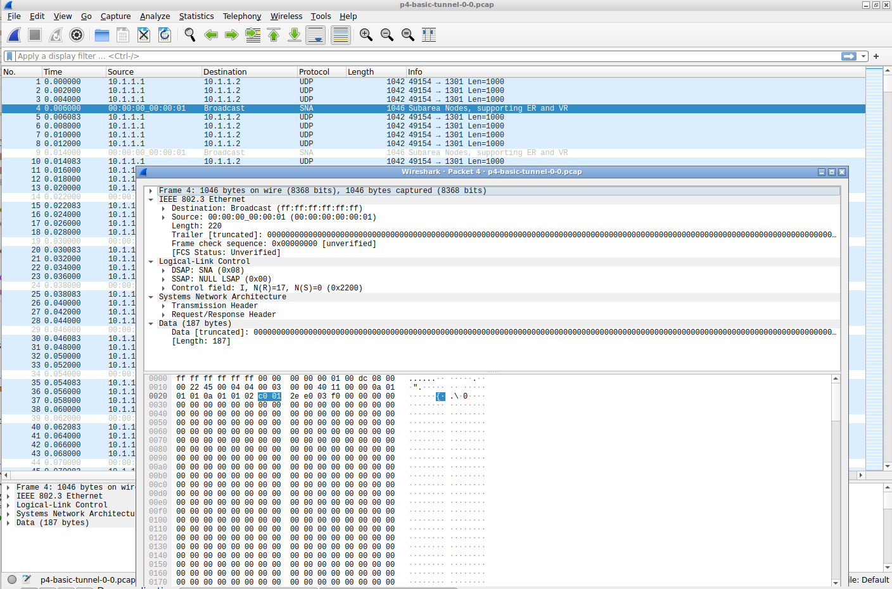

# Basic Tunnel

PS: The same example taken from [`tutorials/exercises/basic_tunnel/`](https://github.com/p4lang/tutorials/tree/master/exercises/basic_tunnel)
This is example used in paper P4sim. For the pcap, we shorten the simulation time to `3s`. Not too large `*.pcap` file.


```bash
# [P4 code] User need to tell switch how to detection the header and how to process with P4.
# Tunnel define in P4 Switch

header myTunnel_t {
    bit<16> proto_id;
    bit<16> dst_id;
}


# [ns3 code] User need tell what format to send
# Tunnel define for the client and server (sending hosts and receiver)

    CustomHeader myTunnelHeader;
    myTunnelHeader.SetLayer(HeaderLayer::LAYER_3); // Network Layer
    myTunnelHeader.SetOperator(ADD_BEFORE);        // add before the ipv4 header

    myTunnelHeader.AddField("proto_id", 16);
    myTunnelHeader.AddField("dst_id", 16);

    myTunnelHeader.SetField("proto_id", 0x0800); // Example: IPv4 protocol
    myTunnelHeader.SetField("dst_id", 0x22);     // Example: Destination ID

    // Set for the NetDevice
    for (unsigned int i = 0; i < hostNum; i++)
    {
        Ptr<NetDevice> device = hostNodes[i].hostDevice.Get(0);
        if (device->GetObject<CustomP2PNetDevice>())
        {
            NS_LOG_DEBUG(
                "Host " << i << " NetDevice is CustomP2PNetDevice, Setting for the Tunnel Header!");
            Ptr<CustomP2PNetDevice> customDevice = DynamicCast<CustomP2PNetDevice>(device);
            customDevice->SetWithCustomHeader(true);
            customDevice->SetCustomHeader(myTunnelHeader);
        }
    }
```


# The result:

Current the tracing inner ns-3 can not trace the data correctly, but the trace with `*.pcap` works well.

From the figure, there are two flows, one with **Noraml UDP** and **the other with custom header**, sending from one hosts to the end point.



From the result of the `*.pcap`:

```bash
-rw-rw-r-- 1 p4 p4 1983154 Jun  4 12:59 p4-basic-tunnel-0-0.pcap
-rw-rw-r-- 1 p4 p4 1983154 Jun  4 12:59 p4-basic-tunnel-1-0.pcap
-rw-rw-r-- 1 p4 p4  397212 Jun  4 12:59 p4-basic-tunnel-1-1.pcap
-rw-rw-r-- 1 p4 p4 1585966 Jun  4 12:59 p4-basic-tunnel-1-2.pcap
-rw-rw-r-- 1 p4 p4 1983154 Jun  4 12:59 p4-basic-tunnel-2-0.pcap
-rw-rw-r-- 1 p4 p4 1983154 Jun  4 12:59 p4-basic-tunnel-3-0.pcap
-rw-rw-r-- 1 p4 p4  397212 Jun  4 12:59 p4-basic-tunnel-3-1.pcap
-rw-rw-r-- 1 p4 p4 1585966 Jun  4 12:59 p4-basic-tunnel-3-2.pcap
-rw-rw-r-- 1 p4 p4      24 Jun  4 12:59 p4-basic-tunnel-4-0.pcap
-rw-rw-r-- 1 p4 p4      24 Jun  4 12:59 p4-basic-tunnel-5-0.pcap
-rw-rw-r-- 1 p4 p4 1585966 Jun  4 12:59 p4-basic-tunnel-5-1.pcap
-rw-rw-r-- 1 p4 p4 1585966 Jun  4 12:59 p4-basic-tunnel-5-2.pcap
```
Here, the sender is `0-0` and recevier is `2-0`, the receiver accept all the packetes without any drop. And the tunnel we use is for two path: short path for tunneled packets, and long path for normal UDP packets. Here the results show the tunneled packets pass from `send 0 -> switch 1 -> switch 3 port 1 in port 0 out -> recevier 2`, the normal UDP packets flow by `send 0 -> switch 1 -> switch 5 -> switch 3 port 2 in port 0 out -> recevier 2`

The right path means the Tunnel functions implement with P4 successfully.


```bash
(p4dev-python-venv) p4@p4:~/workdir/ns-3-dev-git$ ./ns3 run p4-basic-tunnel
[  0%] Building CXX object contrib/p4sim/examples/CMakeFiles/p4-basic-tunnel.dir/p4-basic-tunnel.cc.o
[  0%] Linking CXX executable ns3.39-p4-basic-tunnel-debug
*** Reading topology from file: /home/p4/workdir/ns-3-dev-git/contrib/p4sim/examples/p4src/basic_tunnel/topo.txt with format: P2PTopo
*** Host number: 3, Switch number: 3
*** Link from host 3 to  switch0 with data rate  and delay 
*** Link from host 4 to  switch1 with data rate  and delay 
*** Link from host 5 to  switch2 with data rate  and delay 
*** Link from  switch 0 to  switch 1 with data rate  and delay 
*** Link from  switch 0 to  switch 2 with data rate  and delay 
*** Link from  switch 1 to  switch 2 with data rate  and delay 
Node IP and MAC addresses:
Node 0: IP = 10.1.1.1, MAC = 00:00:00:00:00:01
Node 0: IP = 0x0a010101, MAC = 0x000000000001
Node 1: IP = 10.1.1.2, MAC = 00:00:00:00:00:03
Node 1: IP = 0x0a010102, MAC = 0x000000000003
Node 2: IP = 10.1.1.3, MAC = 00:00:00:00:00:05
Node 2: IP = 0x0a010103, MAC = 0x000000000005
*** P4 switch configuration: /home/p4/workdir/ns-3-dev-git/contrib/p4sim/examples/p4src/basic_tunnel/basic_tunnel.json, 
 /home/p4/workdir/ns-3-dev-git/contrib/p4sim/examples/p4src/basic_tunnel/flowtable_0.txt
*** P4 switch configuration: /home/p4/workdir/ns-3-dev-git/contrib/p4sim/examples/p4src/basic_tunnel/basic_tunnel.json, 
 /home/p4/workdir/ns-3-dev-git/contrib/p4sim/examples/p4src/basic_tunnel/flowtable_1.txt
*** P4 switch configuration: /home/p4/workdir/ns-3-dev-git/contrib/p4sim/examples/p4src/basic_tunnel/basic_tunnel.json, 
 /home/p4/workdir/ns-3-dev-git/contrib/p4sim/examples/p4src/basic_tunnel/flowtable_2.txt
Running simulation...
P4 switch 1 thrift port: 9090
P4 switch 2 thrift port: 9091
P4 switch 3 thrift port: 9092
Simulate Running time: 7185ms
Total Running time: 7263ms
Run successfully!
```


## Overview: P4-enabled Basic Tunnel Simulation in ns-3

This ns-3 simulation script models a **P4-programmable network** using custom net devices and a simple tunnel header. The primary goal is to evaluate how programmable switches (via P4) can process customized packet headers and forward traffic across a topology defined in a text-based input format.

### Features

* **Custom P4 Switch Integration** using the `P4Helper`, which loads a JSON-formatted P4 program and per-switch flow tables.
* **Host-to-host traffic** with:

  * A **tunnel stream** (custom header added) from `h0` to `h1`
  * A **normal UDP stream** from `h0` to `h1` (no custom header)
* **Topology Parsing** from a file (`topo.txt`) using `P4TopologyReader`.
* **Per-link configuration** with adjustable data rate and delay using `P4PointToPointHelper`.
* **Custom L3 Header**:

  * Fields: `proto_id` (16 bits) and `dst_id` (16 bits)
  * Inserted before the IP header for tunnel traffic
* **Traffic Generation** with `OnOffHelper` for two application flows
* **Final Throughput Calculation** and detailed byte statistics for both streams
* **Optional PCAP tracing** for packet-level inspection

---

## Technical Structure

### 1. **Topology Configuration**

* Uses `P4TopologyReader` to parse a topology file (`topo.txt`) of type `P2PTopo`.
* Instantiates hosts and switches, recording their connectivity.
* Assigns IP and MAC addresses to hosts.

### 2. **P4 Switch Setup**

* Each switch loads:

  * `basic_tunnel.json`: the compiled P4 program
  * `flowtable_X.txt`: static forwarding rules
* Configures P4 pipeline, switch rate, and channel type.

### 3. **Custom Tunnel Header**

* A custom L3 header is defined (`CustomHeader`) and prepended to tunnel packets.
* The header includes:

  * `proto_id`: for protocol indication (e.g., 0x0800 for IPv4)
  * `dst_id`: a logical destination identifier
* Applied only to the first stream from host `h0`.

### 4. **Traffic Generation**

Two streams are configured:

* **Stream 1 (Tunnel Stream)**:
  `h0 → h1` with custom tunnel header and UDP

  * Port: `12000`, Rate: `10 Mbps`
* **Stream 2 (Normal UDP)**:
  `h0 → h1` using regular UDP (no custom header)

  * Port: `1301`, Rate: `40 Mbps`

### 5. **Monitoring**

* Callbacks (`TxCallback`, `RxCallback`) track byte counts and timestamps for each stream.
* Final statistics (throughput, byte counts) are printed upon simulation completion.

### 6. **PCAP and Logging**

* PCAP tracing is optionally enabled (`EnablePcapAll()`).
* Logging with `NS_LOG_INFO` for debugging and traceability.

---

## Output Metrics

At the end of simulation:

* Total bytes transmitted and received (per stream and aggregated)
* Throughput (in Mbps) calculated over actual transmission durations
* Start/stop times for both client and sink applications

---

## Usage

```bash
./waf --run "p4-basic-tunnel --runnum=1 --pktSize=1000 --pcap=true"
```

Adjust the following as needed:

* JSON and flowtable files (`p4JsonPath`, `flowTableDirPath`)
* Topology file (`topoInput`)
* Application data rates, packet sizes, or simulation time

