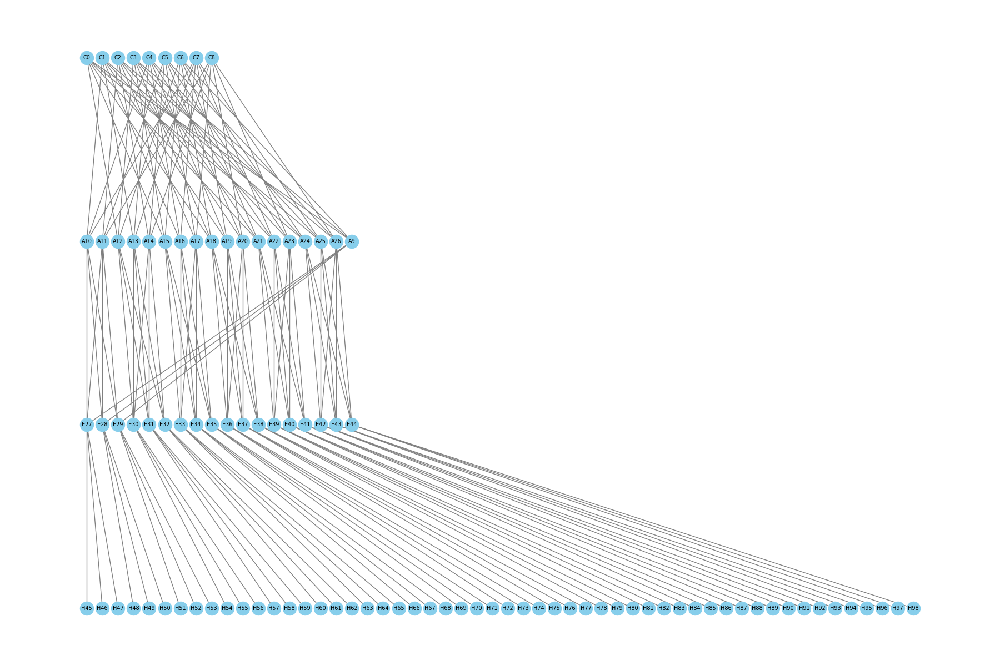

# fat tree

We run `./ns3 run p4-topo-fattree -- --podnum=6 --pcap=true`. The ns-3 script is in [p4sim/examples/p4-topo-fattree.cc](https://github.com/HapCommSys/p4sim/blob/main/examples/p4-topo-fattree.cc), the P4 scrpit is in [p4sim/examples/p4src/fat-tree/](https://github.com/HapCommSys/p4sim/tree/main/examples/p4src/fat-tree).

```bash
Simulate Running time: 55386ms
Total Running time: 55601ms
Run successfully!
```



1. Generate the network topo based on k (k=6).
2. Create the network based on the topo build in 1.
3. Based on the topo, generate the flow table entries for all the P4 switch.
4. Set the configuration of P4 switch.
5. Set the OnOff application to send the traffic.
6. Start the simulation..

PS: In each run, the topo and flow table may be different.

## network topo

The network topo will be:

| Tier | Quantity | Switch ID Range |
| ----------- | ------ | ------------ |
| Core | 9 | 0 \~ 8 |
| Aggregation | 18 | 9 \~ 26 |
| Edge | 18 | 27 \~ 44 |
| **Total** | **45** | — |

