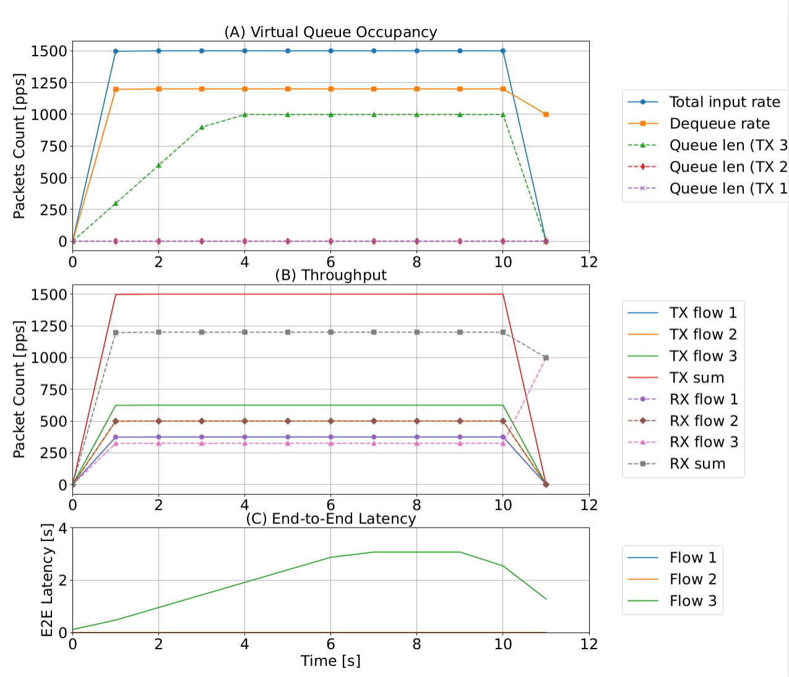

# Tutorial: Priority Queue Scheduling in a P4 Switch

This tutorial walks you through a complete experiment that evaluates **priority queue scheduling** in a P4-programmable switch using the p4sim simulator. You will learn how to run the simulation, collect PCAP traces, extract packet statistics, and generate visualization plots.

---

## Overview

The experiment simulates a network where three flows with different priorities compete for a bottleneck link. The switch enforces strict priority scheduling, and you will observe how:

- High-priority flows maintain low latency and full throughput
- Low-priority flows experience packet buffering and increased latency
- Virtual queue occupancy grows until it hits the maximum queue length

**Topology:**

```
[ Sender Host ] ──► [ P4 Switch ] ──► [ Receiver Host ]
```

**Traffic configuration:**

| Flow | Destination Port | Priority | TX Rate | TX Rate (pps) |
|------|-----------------|----------|---------|---------------|
| Flow 1 | 2000 | Highest | 3 Mbps | 375 pps |
| Flow 2 | 3000 | Medium   | 4 Mbps | 500 pps |
| Flow 3 | 4000 | Lowest   | 5 Mbps | 625 pps |

- Packet size: 1000 bytes
- Total input rate: **1500 pps**
- Switch dequeue rate: **1200 pps** (creates congestion)
- Max queue length: 1000 packets per virtual queue
- Simulation duration: 10 seconds (12 seconds observed due to buffering)

---

## Step 1: Run the Simulation

The simulation script is [p4sim/examples/p4-queue-test.cc](https://github.com/HapCommSys/p4sim/blob/main/examples/p4-queue-test.cc).

Run it from the p4sim build directory:

```bash
./waf --run p4-queue-test
```

This generates four PCAP files in the current directory:

| File | Capture Point | Description |
|------|---------------|-------------|
| `p4-queue-test-0-0.pcap` | Sender (host 0) | All packets leaving the sender |
| `p4-queue-test-1-0.pcap` | Switch ingress | Packets entering the switch |
| `p4-queue-test-1-1.pcap` | Switch egress | Packets leaving the switch |
| `p4-queue-test-2-0.pcap` | Receiver (host 2) | All packets arriving at the receiver |

> **Tip:** You can inspect any of these files directly in Wireshark to verify the traffic flows and timestamps.

---

## Step 2: Understand the Captured Data

The key files for analysis are the **sender-side** and **receiver-side** PCAPs:

- `p4-queue-test-0-0.pcap` — what was sent (before the switch)
- `p4-queue-test-2-0.pcap` — what was received (after the switch)

The difference between them reveals what the switch dropped or delayed.

---

## Step 3: Extract Packet Statistics (Generate CSV Files)

Run the analysis script to parse the PCAP files and produce CSV summaries:

```bash
python3 plot_3_0.py
```

This generates two CSV files:

### `packet_A.csv` — Sender-side packet rates

Parsed from `p4-queue-test-0-0.pcap`. The script:

1. Reads each packet using the `dpkt` library
2. Filters for UDP packets with destination port `2000`, `3000`, or `4000`
3. Groups packets by second using `compute_packet_count()`
4. Writes per-flow counts and a `Total` column to `packet_A.csv`

Example content:

```
,time,2000,3000,4000,Total
0,1,374,499,624,1497
1,2,375,500,625,1500
2,3,375,500,625,1500
...
```

### `packet_B.csv` — Receiver-side packet rates

Parsed from `p4-queue-test-2-0.pcap` using the same process. Because the switch dequeues at only 1200 pps, the total received rate is lower than sent:

```
,time,2000,3000,4000,Total
0,1,375,500,322,1197
1,2,375,500,325,1200
...
```

> Flow 1 and Flow 2 arrive intact; Flow 3 (lowest priority) is throttled by the queue.

---

## Step 4: Understand the Queue Buffer Data

In addition to the PCAP-derived CSVs, the script uses queue occupancy data collected from the simulator's internal queue status logs. These are hardcoded in `plot_3_0.py`:

```python
input_pkts_pps    = [0, 1497, 1500, 1500, 1500, 1500, 1500, 1500, 1500, 1500, 1500, 0]
Egress_pps        = [0, 1197, 1200, 1200, 1200, 1200, 1200, 1200, 1200, 1200, 1200, 999]
egress_buffer_p_3 = [0,  299,  599,  899,  998,  998,  998,  998,  998,  998,  998, 0]
egress_buffer_p_1 = [0]*12  # always 0 — Flow 1 never queues up
egress_buffer_p_2 = [0]*12  # always 0 — Flow 2 never queues up
```

**What this tells you:**

- Input exceeds output by 300 pps → Flow 3's queue grows by ~300 packets/second
- After ~3 seconds, Flow 3's queue saturates at 998 packets (≈ max 1000)
- Flow 1 and Flow 2 queues stay empty — their packets are always dequeued first

> To collect this data yourself, enable queue-status printing in the simulation code (see comments in `p4-queue-test.cc`).

---

## Step 5: Generate the Plot

The same `plot_3_0.py` script produces a three-panel figure after parsing the PCAPs:

```bash
python3 plot_3_0.py
```

Output files:
- `QueueModel.pdf` — publication-quality vector figure
- `queuemodel.png` — raster version for quick preview

### Reading the Figure



**(A) Virtual Queue Occupancy**

Shows the total input rate (1500 pps), the dequeue rate (1200 pps), and the queue depth for each flow. Flow 3's queue grows at 300 pps until it saturates at ~1000 packets. Flows 1 and 2 have zero queue depth throughout.

**(B) Throughput**

Compares TX (sender) and RX (receiver) rates per flow:
- Flow 1 TX = 375 pps, RX = 375 pps → no loss
- Flow 2 TX = 500 pps, RX = 500 pps → no loss
- Flow 3 TX = 625 pps, RX ≈ 325 pps → 300 pps buffered/dropped

**(C) End-to-End Latency**

- Flow 1 average latency: ~0.5 ms
- Flow 2 average latency: ~0.8 ms
- Flow 3 maximum latency: **3.076 s** (due to deep queue buffering)

---

## Summary of Files

| File | How it is created | Purpose |
|------|-------------------|---------|
| `p4-queue-test-0-0.pcap` | Simulation (`p4-queue-test.cc`) | Raw sender-side traffic capture |
| `p4-queue-test-1-0.pcap` | Simulation (`p4-queue-test.cc`) | Switch ingress capture |
| `p4-queue-test-1-1.pcap` | Simulation (`p4-queue-test.cc`) | Switch egress capture |
| `p4-queue-test-2-0.pcap` | Simulation (`p4-queue-test.cc`) | Raw receiver-side traffic capture |
| `packet_A.csv` | `plot_3_0.py` parsing `p4-queue-test-0-0.pcap` | Per-flow packet rates at sender (pps) |
| `packet_B.csv` | `plot_3_0.py` parsing `p4-queue-test-2-0.pcap` | Per-flow packet rates at receiver (pps) |
| `plot_3_0.py` | — | Analysis and plotting script |
| `QueueModel.pdf` / `queuemodel.png` | `plot_3_0.py` | Three-panel result figure |

---

## LaTeX Snippet

```latex
\subsection{Queue Management}

% 3 flow with priority, check the queue status, rate, and latency.
To evaluate the accuracy of queueing and scheduling across different priority levels, we performed the following experiment.
The network topology consists of a simple setup with one sender host, one receiver host, and a switch under test. The sender generates three data flows with descending priority levels and transmission rates of $3 Mbps (375 pps)$, $4 Mbps (500 pps)$, and $5 Mbps (625 pps)$. Each packet has a size of $1000 bytes$, with a total packet rate of $1500 pps$.
The switch is configured with a total processing rate of $1200 pps$, which is lower than the incoming packet rate. This leads to queue congestion within the switch. Each virtual queue in the switch has a maximum length of 1000 packets, and any packets exceeding this limit are dropped.
The simulation runs for 10 seconds under these conditions to evaluate the impact of queueing and scheduling policies on packet handling and priority enforcement.
The results are averaged per second, with delay calculations referenced to the reception time at the receiving end.

\begin{figure}[ht]
    \centering
    \includegraphics[width=\linewidth]{figure/QueueModel.pdf}
    \caption{Queue status, packet flow rate, and end-to-end latency analysis}
    \label{fig:timemodel}
    \Description{}
\end{figure}

Figure \ref{fig:timemodel} shows the simulation results. It analyzes the virtual queue occupancy with input and output rate, the packet throughput on the transmitter and receiver side, and the end-to-end latency. The three subfigures also compare the three flows with different priority levels, where Flow 1 has the highest priority and Flow 3 the lowest. In Figure (A), the total input rate of $1500 pps$ exceeds the dequeue rate of $1200 pps$. As a result, the lower-priority queue for Flow 3 accumulates packets at $300 pps$ until the queue reaches its maximum capacity of 1000 packets. Figure (B) shows the throughput of the three flows. Flow 3 is observed with a transmission rate of $625 pps$ at the sender side and $325 pps$ at the receiver side. The reason is that these packets are buffered in the virtual queue. In Figure (C), the end-to-end (E2E) latency increases by an average of $0.5 ms$ for Flow 1 and $0.8 ms$ for Flow 2, while Flow 3 experiences a maximum latency of $3.076 s$. The latency is from the total occupied virtual queue with a length of 1000 packets. This experiment quantitatively validates the accuracy and correctness of queueing mechanisms within the switch. It vividly demonstrates the impact of priority queue scheduling in a switch on latency and congestion, making it a valuable reference for teaching congestion control and queue management.
```
