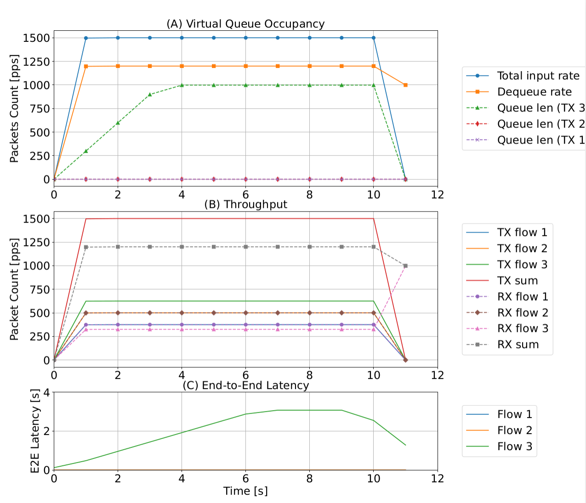

**Due to the length of the paper, the discussion was not included, but the scheduling of multiple priority queues was monitored.**

## Queue Status Monitor

### How to get the result

The scrpit we run [p4sim/examples/p4-queue-test.cc](https://github.com/HapCommSys/p4sim/blob/main/examples/p4-queue-test.cc)

PS: total client sending time 10s, but because of buffering, the total time we observe with 12s.

You could also check the `*.pcap` and get the plot in `Wireshark`, same with our drawing.

The result we get with print the status of each queue `egress_buffer_p_3`, `egress_buffer_p_1` and `egress_buffer_p_2` (by changing the code, not suggested to do that).

```python
# Result of the test from we got.
input_pkts_pps = [0, 1497, 1500, 1500, 1500, 1500, 1500, 1500, 1500, 1500, 1500, 0]
Egress_pps =     [0, 1197, 1200, 1200, 1200, 1200, 1200, 1200, 1200, 1200, 1200, 999]
egress_buffer_p_3 = [0, 299, 599, 899, 998, 998, 998, 998, 998, 998, 998, 0]
egress_buffer_p_1 = [0]*12
egress_buffer_p_2 = [0]*12
time = [i for i in range(0, 12)]
```

The result of `input_pkts_pps` from file `packet_A.csv`, the result of `Egress_pps` from `packet_B.csv`.


### Queue Management


To evaluate the accuracy of queueing and scheduling across different priority levels, we performed the following experiment.
The network topology consists of a simple setup with one sender host, one receiver host, and a switch under test. The sender generates three data flows with descending priority levels and transmission rates of $3 Mbps (375 pps)$, $4 Mbps (500 pps)$, and $5 Mbps (625 pps)$. Each packet has a size of $1000 bytes$, with a total packet rate of $1500 pps$.
The switch is configured with a total processing rate of $1200 pps$, which is lower than the incoming packet rate. This leads to queue congestion within the switch. Each virtual queue in the switch has a maximum length of 1000 packets, and any packets exceeding this limit are dropped. 
The simulation runs for 10 seconds under these conditions to evaluate the impact of queueing and scheduling policies on packet handling and priority enforcement. 
The results are averaged per second, with delay calculations referenced to the reception time at the receiving end.




Figure shows the simulation results. It analyzes the virtual queue occupancy with input and output rate, the packet throughput on the transmitter and receiver side, and the end-to-end latency. The three subfigures also compare the three flows with different priority levels, where Flow 1 has the highest priority and Flow 3 the lowest. In Figure (A), the total input rate of $1500 pps$ exceeds the dequeue rate of $1200 pps$. As a result, the lower-priority queue for Flow 3 accumulates packets at $300 pps$ until the queue reaches its maximum capacity of 1000 packets. Figure (B) shows the throughput of the three flows. Flow 3 is observed with a transmission rate of $625 pps$ at the sender side and $325 pps$ at the receiver side. The reason is that these packets are buffered in the virtual queue. In Figure (C), the end-to-end (E2E) latency increases by an average of $0.5 ms$ for Flow 1 and $0.8 ms$ for Flow 2, while Flow 3 experiences a maximum latency of $3.076 s$. The latency is from the total occupied virtual queue with a length of 1000 packets. This experiment quantitatively validates the accuracy and correctness of queueing mechanisms within the switch. It vividly demonstrates the impact of priority queue scheduling in a switch on latency and congestion, making it a valuable reference for teaching congestion control and queue management.

```markdown
\subsection{Queue Management}

% 3 flow with priority, check the queue status, rate, and latency.
To evaluate the accuracy of queueing and scheduling across different priority levels, we performed the following experiment.
The network topology consists of a simple setup with one sender host, one receiver host, and a switch under test. The sender generates three data flows with descending priority levels and transmission rates of $3 Mbps (375 pps)$, $4 Mbps (500 pps)$, and $5 Mbps (625 pps)$. Each packet has a size of $1000 bytes$, with a total packet rate of $1500 pps$.
The switch is configured with a total processing rate of $1200 pps$, which is lower than the incoming packet rate. This leads to queue congestion within the switch. Each virtual queue in the switch has a maximum length of 1000 packets, and any packets exceeding this limit are dropped. 
The simulation runs for 10 seconds under these conditions to evaluate the impact of queueing and scheduling policies on packet handling and priority enforcement. 
The results are averaged per second, with delay calculations referenced to the reception time at the receiving end.

\begin{figure}[ht]
    \centering
    \includegraphics[width=\linewidth]{figure/QueueModel.pdf}
    \caption{Queue status, packet flow rate, and end-to-end latency analysis}
    \label{fig:timemodel}
    \Description{}
\end{figure}

Figure \ref{fig:timemodel} shows the simulation results. It analyzes the virtual queue occupancy with input and output rate, the packet throughput on the transmitter and receiver side, and the end-to-end latency. The three subfigures also compare the three flows with different priority levels, where Flow 1 has the highest priority and Flow 3 the lowest. In Figure (A), the total input rate of $1500 pps$ exceeds the dequeue rate of $1200 pps$. As a result, the lower-priority queue for Flow 3 accumulates packets at $300 pps$ until the queue reaches its maximum capacity of 1000 packets. Figure (B) shows the throughput of the three flows. Flow 3 is observed with a transmission rate of $625 pps$ at the sender side and $325 pps$ at the receiver side. The reason is that these packets are buffered in the virtual queue. In Figure (C), the end-to-end (E2E) latency increases by an average of $0.5 ms$ for Flow 1 and $0.8 ms$ for Flow 2, while Flow 3 experiences a maximum latency of $3.076 s$. The latency is from the total occupied virtual queue with a length of 1000 packets. This experiment quantitatively validates the accuracy and correctness of queueing mechanisms within the switch. It vividly demonstrates the impact of priority queue scheduling in a switch on latency and congestion, making it a valuable reference for teaching congestion control and queue management.
```

